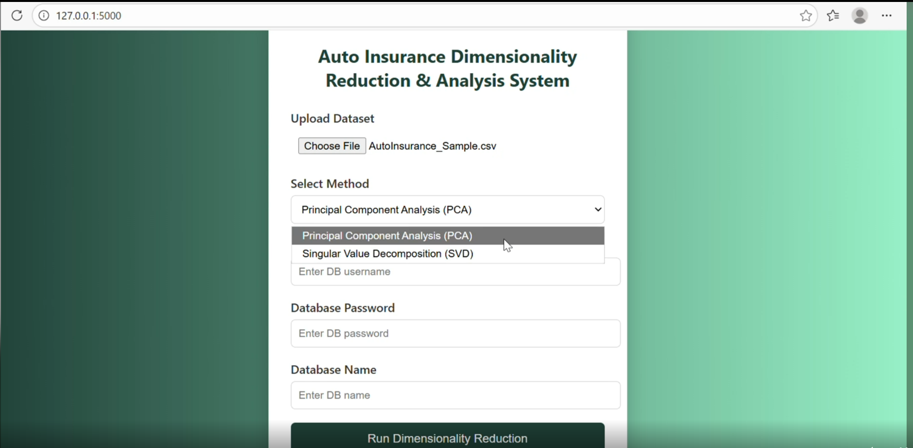
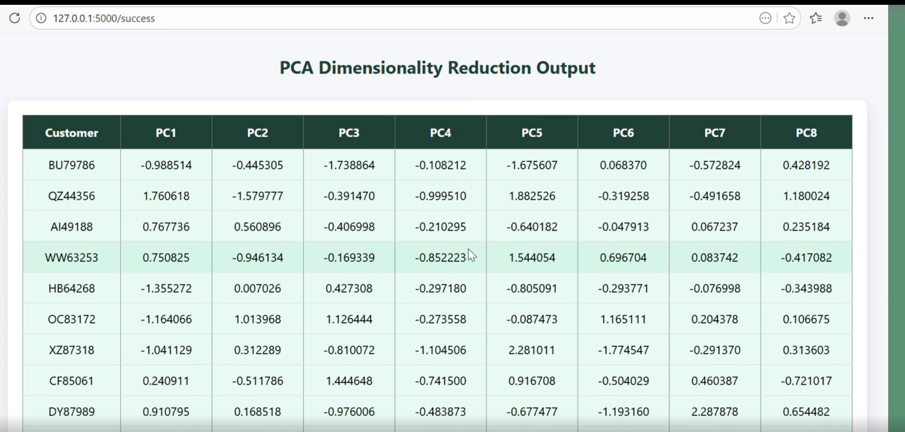

📊 Insurance Dimensionality Reduction – PCA & SVD (Flask App)

## 🎬 Project Demo

🔍 Project Overview

This project demonstrates the end-to-end deployment of dimensionality reduction techniques (PCA & SVD) on an Insurance Customer Dataset using Python, Scikit-Learn Pipelines, Flask, and MySQL.

The application allows users to upload insurance data, select PCA or SVD, and run the selected model dynamically through a clean web interface.
The transformed features are stored in a database and displayed via a success UI.

🎯 Business Problem

Insurance companies handle high-dimensional customer data, which increases:

Computational cost

Model complexity

Processing time

Reducing dimensionality helps in efficient customer segmentation, cross-selling strategies, and retention analysis.

🧠 Solution Approach

Built separate PCA and SVD pipelines using Scikit-Learn

Used standardization + imputation + dimensionality reduction

Deployed both models inside a single Flask application

UI allows dynamic selection of PCA or SVD

Results are saved to separate database tables for comparison

🧩 CRISP-ML(Q) Framework
1. Business & Data Understanding

Objective: Reduce dimensionality while retaining maximum information

Constraint: Avoid loss of critical customer behavior data

Success Criteria: ≥70% variance retention

2. Data Preparation

Missing value handling (mean imputation)

Feature scaling using StandardScaler

Selection of numeric features

3. Model Building

PCA using sklearn.decomposition.PCA

SVD using sklearn.decomposition.TruncatedSVD

Pipeline-based implementation

4. Model Evaluation

Explained variance analysis

Elbow method using KneeLocator

5. Deployment

Flask web application

MySQL database integration

File upload + model selection UI

6. Monitoring & Maintenance

Independent pipelines allow easy model updates

Modular design for future enhancements

🛠️ Tech Stack

Programming Language: Python

ML Libraries: Scikit-Learn, NumPy, Pandas

Web Framework: Flask

Database: MySQL

Model Persistence: Joblib

Visualization: Matplotlib

UI: HTML + CSS

📁 Project Structure
insurance-dim-reduction/
│
├── app.py
├── insurance_pca_model.joblib
├── insurance_svd_model.joblib
│
├── templates/
│   ├── index.html
│   └── data.html
│
├── README.md
└── requirements.txt

🚀 How to Run the Project
1️⃣ Clone the Repository
git clone https://github.com/your-username/insurance-dim-reduction.git
cd insurance-dim-reduction

2️⃣ Install Dependencies
pip install -r requirements.txt

3️⃣ Run Flask App
python app.py

4️⃣ Access the Application
http://127.0.0.1:5000/

🖥️ Application Workflow

Upload insurance dataset (CSV / Excel)

Select dimensionality reduction technique:

PCA

SVD

Enter database credentials

Run model

View transformed features in UI

Results saved in MySQL database

🗃️ Database Tables Created
Model	Table Name
PCA	insurance_pca_output
SVD	insurance_svd_output
💡 Key Highlights

Pipeline-based ML deployment

Dynamic model selection

Clean and professional UI

Production-style Flask architecture

Interview & academic submission ready

📈 Future Enhancements

Add clustering after PCA/SVD

Download output as CSV

Authentication & role-based access

Cloud deployment (AWS / Azure)

Visualization dashboards

🙋 Author

Hariharan
Data Analyst | Data Scientist

📧 Email: hari06haranhari@gmail.com

